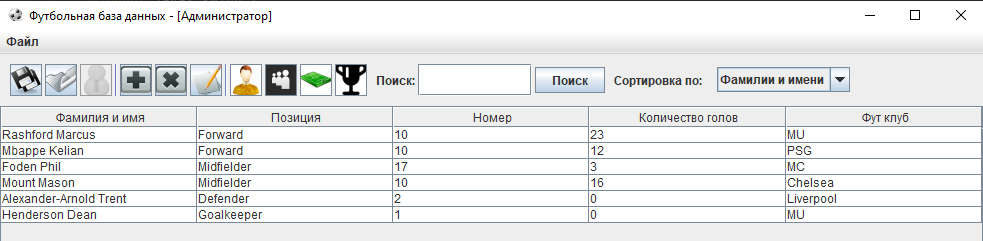
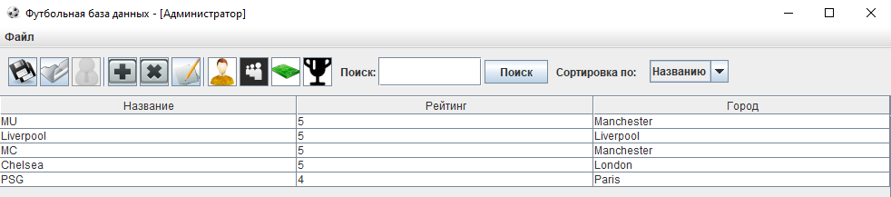
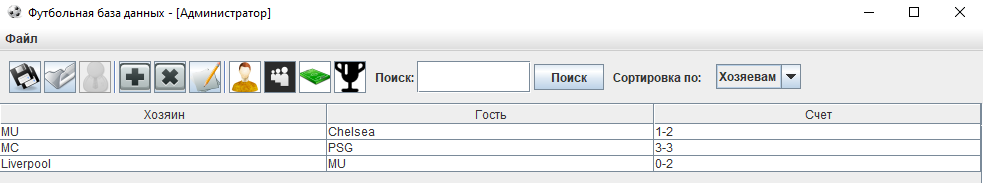
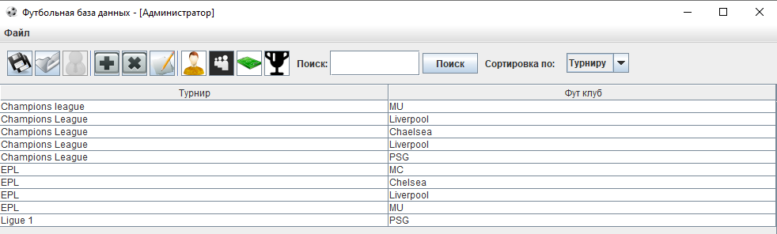
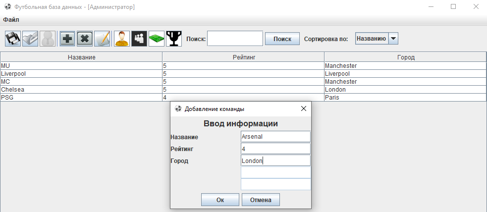

# football database


- [Installation](#anc1)
- [Usage](#anc2)
- [Contribution](#anc3)
- [Example of work](#anc4)
- [License](#anc5)

---

Application in which database of football players, football clubs, matches and tournaments for football organiztions are implemented
Implemented by Java 8.

<a id="anc1"></a>

## Installation
- The sources for application can be downloaded from the [Github repo](https://github.com/rrtty0/football_database.git).

* You can either clone the public repository:
```
        $ git clone https://github.com/rrtty0/football_database.git 
```
<a id="anc2"></a>

## Usage

- For use this application you must downloaded [JDK 1.8](https://www.oracle.com/ru/java/technologies/javase/javase8-archive-downloads.html)

<a id="anc3"></a>

## Contribution
1. _Clone repo_ and _create a new branch_:
```
        $ git clone https://github.com/rrtty0/football_database.git
        $ git branch name_for_new_branch
        $ git checkout name_for_new_branch
```
2. _Make changes_ and _test_
3. _Submit Pull Request_ with comprehensive description of changes

<a id="anc4"></a>

## Example of work



---



---



---



---



---

<a id="anc5"></a>

## License
Source Available License Agreement - [Apache License v2.0](./LICENSE).